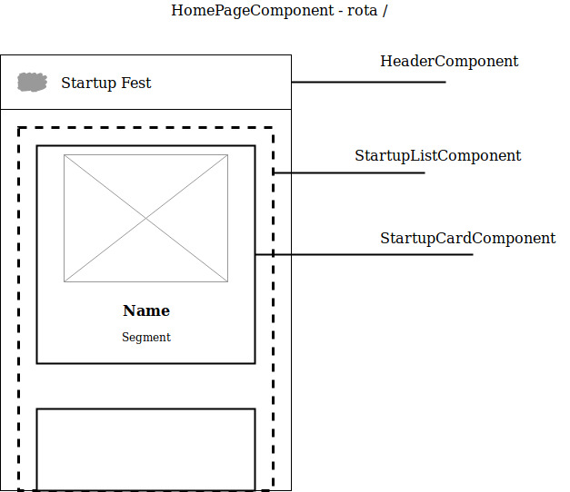
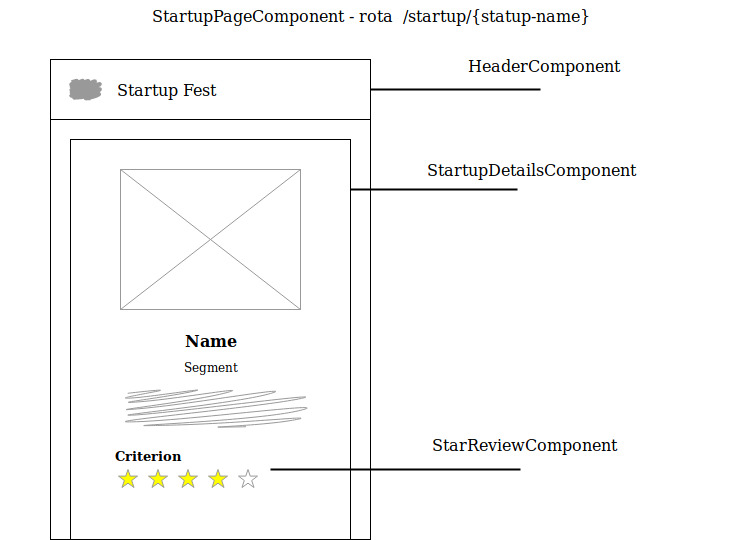
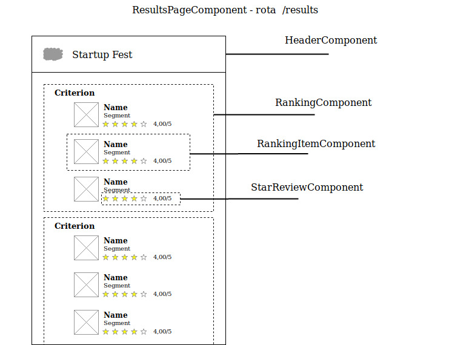

# Startup Fest WebApp

This project was generated with [Angular CLI](https://github.com/angular/angular-cli) version 7.3.8.

## Components
Structure of the built components:

## Build

Run `npm run build:prod` to build the project to production. The build artifacts will be stored in the `dist/` directory.

## Run Serve

Run `ng s -o` to start the project.
